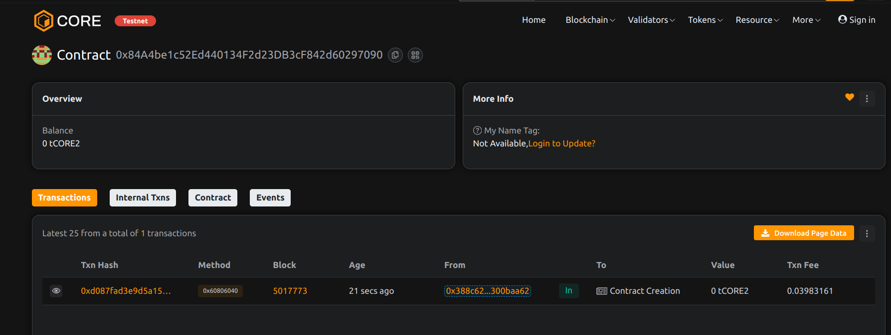

# Project Title: CrateForge: Adaptive Loot Crate Smart Contract
done by Abhishek Ranawat 
## Project Description

CrateForge is a blockchain-based loot crate system that allows players to open randomized reward boxes. Rewards are determined based on weightings, ensuring dynamic rarity distributions.

## Project Vision

To bring fair, provably random loot mechanics to blockchain games and marketplaces, enabling true ownership and dynamic item pools.

## Key Features

- Loot crates with weighted item chances
- ETH-based

 crate opening and payouts
- Owner-adjustable item pool and crate pricing
- Transparent random distribution logic

## Future Scope 

- NFT or ERC-20 item drops
- Chainlink VRF integration for secure randomness
- Item crafting and crate fusion mechanics
- Marketplace integration for opened rewards
- project done by Abhishek Ranawat 

## Contract Details
0x84A4be1c52Ed440134F2d23DB3cF842d60297090

